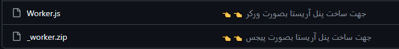
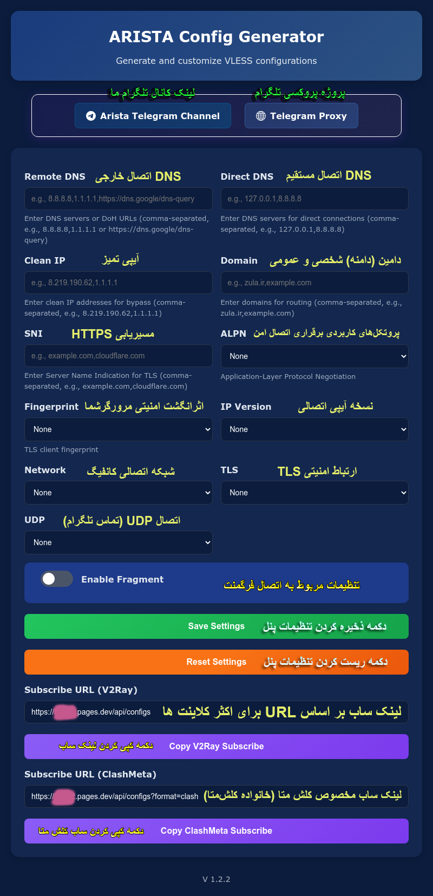

<h1 align="center">🚀 پنل آریستا 🚀</h1> 

#### 🌏 [English 👈📑](https://translate.google.com/translate?sl=auto&tl=en&u=https://github.com/arista-project/Arista-Panel)

<br>

<p align="center">
 یک پنل کاربری برای تولید کانفیگ‌های رایگان و امن 
</p>
<p align="center" dir="rtl">
   با استفاده از Cloudflare Worker and Pages
</p>

<br>

<p align="center">
  
  <a href="https://x.com/aristaproject"> </a>
  <a href="https://www.youtube.com/@aristaproject-m3o" target="_blank"></a>
  <a href="mailto:aristaproject1@gmail.com"> </a>
  <a href="https://t.me/aristaproject" target="_blank"></a> 
  <a href="https://github.com/arista-project/" target="_blank"></a> 
</p>

<div align="center" dir="rtl">
  <h3>✍️👆 دسترسی سریع شما به صفحات ما در شبکه‌های مجازی 👆✍️</h3>
</div>
<p align="center">
[👉 دسترسی به آموزش‌ها در یوتیوب 👈](https://www.youtube.com/@aristaproject-m3o)
</p>
<br>
<br>
<p align="center">
   
  
</p>
<br>

## معرفی 😎

🧠 هدف اصلی کد :

این سرویس آنلاین ، تولید و مدیریت کانفیگ‌های پروکسی (VLESS/V2Ray و ClashMeta) را به صورت خودکار انجام می‌دهد. کاربران از طریق پنل وب ، می‌توانند تنظیمات اتصال ، امنیت و شبکه را سفارشی کرده و لینک اشتراک دریافت کنند.


* با **Cloudflare Workers**
* با **Cloudflare Pages**
- می‌توانید هم بصورت پیجس و هم بصورت ورکر پنل خود را بسازید .
##
  
## 🌟 اگه **پنل ARISTA** براتون مفید بوده ، با حمایتتون بهمون دلگرمی می‌دید 🌟

## 💙 هدیه‌ای کوچک ، امیدی بزرگ (خانه ایتام ریحانه) ❤️

اگر این پروژه برایتان سودمند بود ، می‌توانید با یک هدیه کوچک ، دنیایی از امید و شادی به کودکان بی‌سرپرست ببخشید.

با هر حمایت شما ، لبخندی به دل کودکی می‌نشیند و روشنایی به زندگی او بازمی‌گردد.

حمایت شما می‌تواند به معنای یک وعده غذای گرم ، لباسی نو ، یا حتی لحظه‌ای از شادی باشد که مدت‌هاست دور از دسترس آن‌هاست.

### USDT (TRC20)

```text
TLCXUufe6FmD518PG9F6oonH8G3by4bavz
```
هر کمک ، هر چند کوچک ، آینده‌ای روشن‌تر و دنیایی پر از امید برای یک کودک می‌سازد. 🌟
##

## 🧩 اجزای اصلی کد :

1️⃣ جمع‌آوری و پردازش کانفیگ‌ها
   - 📥 دریافت خودکار کانفیگ‌ها از منابع عمومی
   - 🧪 تست سلامت و استخراج خطوط معتبر

2️⃣ لیست‌های امنیتی
   - 🛡️ استفاده از لیست‌های معتبر برای مسدودسازی دامنه‌های مخرب
   - 🚫 پوشش دامنه‌های تبلیغاتی، فیشینگ و خطرناک

3️⃣ توابع پردازش کانفیگ
   - 🔍 استخراج کانفیگ
   - ✅ تست سلامت کانفیگ‌ها
   - ⚙️ اعمال تنظیمات سفارشی
   - 🔒 افزودن قابلیت‌های امنیتی
   - 🔄 تبدیل فرمت‌های مختلف

4️⃣ پنل تحت وب
   - 📊 پشتیبانی از چندین فرمت خروجی
   - 💾 ذخیره‌سازی تنظیمات

5️⃣ قابلیت‌های امنیتی
   - 🚦 مسدودسازی پیشرفته
   - 🌐 پشتیبانی از DNS امن
   - 🔐 تنظیمات TLS پیشرفته


🛠 تکنولوژی‌های استفاده شده :
   - ⚡️ پلتفرم Cloudflare Workers
   - 🎨 فناوری‌های استاندارد وب


✨ ویژگی‌های کلیدی :
   - 🤖 جمع‌آوری خودکار کانفیگ‌های سالم
   - 🔗 تولید لینک‌های اشتراک شخصی‌شده
   - 📋 پشتیبانی از چندین فرمت خروجی
   - 🎯 رابط کاربری بهینه
   - 🗄️ سیستم کش هوشمند
   - 🛡️ لایه‌های امنیتی چندگانه


📌 نحوه استفاده :

  1. 🌐 مراجعه به پنل وب
  2. ⚙️ اعمال تنظیمات مورد نظر
  3. 📨 دریافت لینک اشتراک
  4. 📱 استفاده در کلاینت‌های v2ray, hiddify, nekobox, karing, clashmeta, ...


 -🚀 این سرویس به عنوان یک راه‌حل کامل برای مدیریت کانفیگ‌های پروکسی طراحی شده و به راحتی قابل استقرار است.

##

## 🔧 راهنمای بهینه‌سازی دسترسی به پنل آریستا 🔧

‼️ برای استفاده‌ی بهینه و بدون مشکل از خدمات پنل آریستا ، لطفاً به نکات زیر توجه کنید :

## 📱 پیشنهاد اول :

# پاک کردن کش مرورگر

برای اطمینان از بارگذاری آخرین نسخهٔ پنل و جلوگیری از خطاهای احتمالی، کش مرورگر خود را پاک کنید.

  روش پاک کردن کش در مرورگرهای مختلف :

 # 📲 اندروید :

🟢 Chrome : •منو (سه نقطه) → Settings → Privacy and security → Clear browsing data •تیک گزینه‌های Cached images and files و Cookies and site data را بزنید → Clear data

🟠 Firefox : •منو (سه نقطه) → Settings → Delete browsing data → انتخاب موارد مورد نظر → Delete browsing data

  🔵 مرورگر پیش‌فرض: •به Settings → Apps → مرورگر مورد نظر → Storage → Clear cache بروید


# 💻 در دسکتاپ :

🟢 Chrome/Edge :  Ctrl+Shift+Delete(ویندوز) یا Cmd+Shift+Delete (مک)

🟠 Firefox :  Ctrl+Shift+Delete(ویندوز) یا Cmd+Shift+Delete (مک)

🔵 Safari :  Settings> Privacy > Manage Website Data > Remove All


## 🌐 پیشنهاد دوم : 

# استفاده از مرورگر اختصاصی (توصیه‌شده)

  🚨 توجه مهم :

سرویس ورکر (Worker) به صورت کامل سمت کلاینت (کاربر) اجرا می‌شود. این به معنای آن است که سرعت و کیفیت اتصال شما تا حد زیادی به مرورگر و دستگاه شما بستگی دارد.

  ⚠️ برای اجرای بهینهٔ ورکر (Worker) و تجربهٔ بهتر ، استفاده از یک مرورگر اختصاصی پیشنهاد می‌شود.


  ‼️ با رعایت این نکات، از حداکثر سرعت و پایداری پنل آریستا لذت ببرید!

##

## 🔍 راهکارهای مدیریت سابسکرایپشن بر اساس پلتفرم (نسخه جامع)  

🍎 iOS (آیفون/آیپد) :  
- [Hiddify](https://apps.apple.com/app/hiddify) - راهکار سبک با رابط کاربری ساده
- [Stash](https://apps.apple.com/app/stash) - گزینه حرفه‌ای با تنظیمات پیشرفته  
- [Karing](https://apps.apple.com/app/karing) - چندپلتفرمی با پشتیبانی عالی 
- [Eger](https://apps.apple.com/app/egern) - طراحی مدرن و عملکرد روان  
- [Clash Mi](https://apps.apple.com/ru/app/clash-mi/id6744321968) - هسته قدرتمند Mihomo (Clash.Meta)
- [Jajams](https://apps.apple.com/app/jamjams) - گزینه جدید با قابلیت‌های منحصر بفرد  

🤖 Android :  
- [ClashMetaForAndroid](https://github.com/MetaCubeX/ClashMetaForAndroid) - انعطاف‌پذیر با پیکربندی پیشرفته (برای کاربران حرفه‌ای)
- [FLClash](https://github.com/chen08209/FlClash/releases) - همه فن حریف (بهترین برای کلش)
- [Clash Mi](https://github.com/KaringX/karing/releases) - هسته قدرتمند Mihomo (Clash.Meta)
- [Surfboard](https://t.me/surfboardnews) - ساده و کاربرپسند برای مبتدیان  
- [NekoBox](https://github.com/MatsuriDayo/NekoBoxForAndroid) - سبک وزن با امکانات کامل  
- [Hiddify-Next](https://github.com/hiddify/hiddify-next) - نسخه بهبودیافته Hiddify  
- [v2rayNG](https://github.com/2dust/v2rayNG) - محبوب و پایدار  
- [Shadowsocks for Android](https://github.com/shadowsocks/shadowsocks-android) - کلاسیک و قابل اعتماد  
- [Karing](https://github.com/KaringX/karing/releases/) - سازگار با تمام دستگاه‌ها  

💻 Windows:  
- [Hiddify-Next](https://github.com/hiddify/hiddify-next/releases) - با پشتیبانی از پروتکل‌های متنوع  
- [v2rayN](https://github.com/2dust/v2rayN) - جامع و پرامکانات  
- [Shadowsocks-windows](https://github.com/shadowsocks/shadowsocks-windows) - راهکار سنتی و کارآمد  
- [NekoRay](https://github.com/MatsuriDayo/nekoray) - مدیریت آسان کانفیگ‌ها  
- [Karing](https://karing.app/download) - یکپارچه با اکوسیستم  
- [Clash Verge](https://github.com/clash-verge-rev/clash-verge-rev/releases) - هسته قدرتمند Mihomo (Clash.Meta)

🍏 macOS:  
- [Hiddify-Next](https://github.com/hiddify/hiddify-next/releases) - بهینه‌شده برای مک  
- [Karing](https://karing.app/download) - تجربه کاربری یکپارچه  

## 🛠️ راهنمای انتخاب :  

1️⃣ کاربران مبتدی : [Surfboard] (Android) یا [Jamjams] (iOS)  

2️⃣ نیازهای معمولی : [v2rayNG] یا [Hiddify]  

3️⃣ کاربران پیشرفته : [ClashMeta] یا [NekoRay]


⚠️ نکته : انتخاب اپلیکیشن مناسب بستگی به نیازهای شما دارد.  

 ‼️ پیشنهاد ما : برای تست سرعت و پایداری، چند گزینه را امتحان کنید.

##

## متغیرهای محیطی (داشبورد پنل)
<div dir="rtl">
<table>
  <thead>
    <th>متغیر</th>
    <th>کاربرد</th>
  </thead>
  <tbody  align="center">
    <tr>
      <td><b>UUID</b></td>
      <td>UUID برای پروتکل VLESS</td>
    </tr>
    <tr>
      <td><b>Clean IP</b></td>
      <td>آیپی تمیز</td>
    </tr>
    <tr>
      <td><b>Domain</b></td>
      <td>استفاده از دامین شخصی</td>
    </tr>
    <tr>
      <td><b>SNI</b></td>
      <td>استفاده برای مسیر فرعی</td>
    </tr>
    <tr>
      <td><b>FALLBACK</b></td>
      <td>اجرا شده در کلش متا</td>
    </tr>
  </tbody>
</table>
</div>

## با تشکر از گروه آریستا
