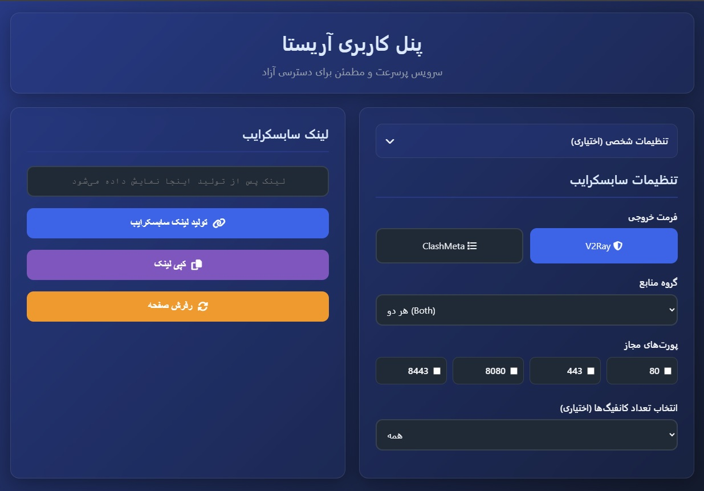
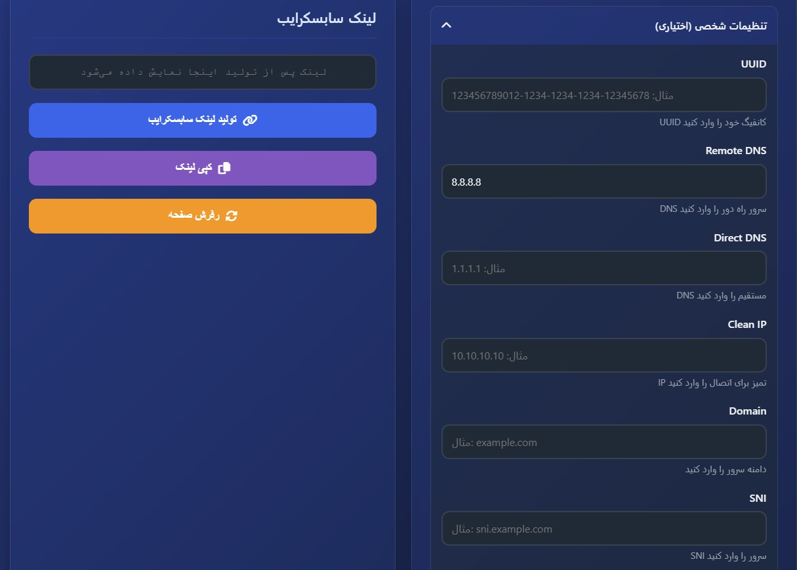
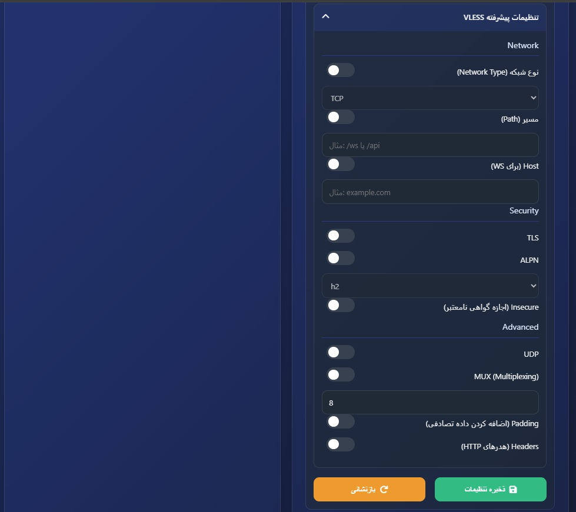

<h1 align="center">🚀 ARISTA Panel 🚀</h1>

### 🌏 Readme in [Farsi](README_FA.md)

<p align="center">
  
  
  
</p>
<br>


🔍 راهکارهای مدیریت سابسکرایپشن بر اساس پلتفرم (نسخه جامع)  

🍎 iOS (آیفون/آیپد):  
- [Hiddify](https://apps.apple.com/app/hiddify) - راهکار سبک با رابط کاربری ساده
- [Stash](https://apps.apple.com/app/stash) - گزینه حرفه‌ای با تنظیمات پیشرفته  
- [Karing](https://apps.apple.com/app/karing) - چندپلتفرمی با پشتیبانی عالی 
- [Eger](https://apps.apple.com/app/egern) - طراحی مدرن و عملکرد روان  
- [Clash Mi](https://apps.apple.com/ru/app/clash-mi/id6744321968) - هسته قدرتمند Mihomo (Clash.Meta)
- [Jajams](https://apps.apple.com/app/jamjams) - گزینه جدید با قابلیت‌های منحصر بفرد  

🤖 Android:  
• ClashMetaForAndroid (https://github.com/MetaCubeX/ClashMetaForAndroid) - انعطاف‌پذیر با پیکربندی پیشرفته (برای کاربران حرفه‌ای)
• Clash Mi (https://github.com/KaringX/karing/releases) - هسته قدرتمند Mihomo (Clash.Meta)
• Surfboard (https://t.me/surfboardnews) - ساده و کاربرپسند برای مبتدیان  
• NekoBox (https://github.com/MatsuriDayo/NekoBoxForAndroid) - سبک وزن با امکانات کامل  
• Hiddify-Next (https://github.com/hiddify/hiddify-next) - نسخه بهبودیافته Hiddify  
• v2rayNG (https://github.com/2dust/v2rayNG) - محبوب و پایدار  
• Shadowsocks for Android (https://github.com/shadowsocks/shadowsocks-android) - کلاسیک و قابل اعتماد  
• Karing (https://github.com/KaringX/karing/releases/) - سازگار با تمام دستگاه‌ها  

💻 Windows:  
• Hiddify-Next (https://github.com/hiddify/hiddify-next/releases) - با پشتیبانی از پروتکل‌های متنوع  
• v2rayN (https://github.com/2dust/v2rayN) - جامع و پرامکانات  
• Shadowsocks-windows (https://github.com/shadowsocks/shadowsocks-windows) - راهکار سنتی و کارآمد  
• NekoRay (https://github.com/MatsuriDayo/nekoray) - مدیریت آسان کانفیگ‌ها  
• Karing (https://karing.app/download) - یکپارچه با اکوسیستم  
• Clash Verge (https://github.com/clash-verge-rev/clash-verge-rev/releases) - هسته قدرتمند Mihomo (Clash.Meta)

🍏 macOS:  
• Hiddify-Next (https://github.com/hiddify/hiddify-next/releases) - بهینه‌شده برای مک  
• Karing (https://karing.app/download) - تجربه کاربری یکپارچه  

🛠️ راهنمای انتخاب:  
1️⃣ کاربران مبتدی: [Surfboard] (Android) یا [Jamjams] (iOS)  
2️⃣ نیازهای معمولی: [v2rayNG] یا [Hiddify]  
3️⃣ کاربران پیشرفته: [ClashMeta] یا [NekoRay]

🔹 نکته: انتخاب اپلیکیشن مناسب بستگی به نیازهای شما دارد.  
🔹 پیشنهاد ما: برای تست سرعت و پایداری، چند گزینه را امتحان کنید.


## Introduction

This project is aimed to provide a user panel to access FREE, SECURE and PRIVATE **VLESS**, **Trojan** and **Shadowsocks** configs or services are blocked by ISPs , It ensures connectivity even when domains , offering two deployment options :

- **Workers** deployment
- **Pages** deployment

🌟 If you found **ARISTA Panel** valuable, Your donations make all the difference 🌟

### USDT (BEP20)

```text

```

## Features

1. **Free and Private**: No costs involved and the server is private.
2. **Intuitive Panel:** Streamlined for effortless navigation, configuration and use.
3. **Versatile Protocols:** Provides VLESS, Trojan and Wireguard (Warp) protocols.
4. **Warp Pro configs:** Optimized Warp for crucial circumstances.
5. **Fragment support:** Supports Fragment functionality for crucial network situations.
6. **Comprehensive Routing Rules:** Bypassing Iran/China/Russia and LAN, Blocking QUIC, Porn, Ads, Malwares, Phishing and also bypassing sanctions.
7. **Chain Proxy:** Capable of adding a chain proxy to fix IP.
8. **Broad client compatibility:** Offers subscription links for Xray, Sing-box and Clash-Mihomo core clients.
9. **Password-protected panel:** Provides secure and private panel with password protection.
10. **Fully customizable:** Supports setting up clean IP-domains, Proxy IPs, DNS servers, choosing ports and protocols, Warp endpoints and more.

## Limitations

1. **UDP transport**: VLESS and Trojan protocols on workers do not handle **UDP** properly, so it is disabled by default (affecting features like Telegram video calls), UDP DNS is also unsupported. DoH is enabled by default for enhanced security.
2. **Request limit**: each worker supports 100K requests per day for VLESS and Trojan, suitable for 2-3 users. You can use custom personal domains to bypass limitation on VLESS/Trojan (Workers deployment) or opt for limitless Warp configurations.

## Getting started

- [Installation methods]()
- [Configuration]()
- [How to use]()
- [FAQ](https://arista-project.github.io/Arista-Panel/en/faq/)

## Supported Clients

|       Client        |     Version      |      Fragment      |      Warp Pro      |
| :-----------------: | :--------------: | :----------------: | :----------------: |
|     **v2rayNG**     | 1.10.2 or higher | :heavy_check_mark: | :heavy_check_mark: |
|     **v2rayN**      | 7.12.5 or higher | :heavy_check_mark: | :heavy_check_mark: |
|   **v2rayN-PRO**    |  1.9 or higher   | :heavy_check_mark: | :heavy_check_mark: |
|      **Husi**       |                  | :heavy_check_mark: |        :x:         |
|    **Sing-box**     | 1.12.0 or higher | :heavy_check_mark: |        :x:         |
|    **Streisand**    | 1.6.48 or higher | :heavy_check_mark: | :heavy_check_mark: |
|      **V2Box**      |                  |        :x:         |        :x:         |
|  **Shadowrocket**   |                  |        :x:         |        :x:         |
|     **Nekoray**     |                  | :heavy_check_mark: |        :x:         |
|     **Hiddify**     | 2.5.7 or higher  | :heavy_check_mark: | :heavy_check_mark: |
|     **MahsaNG**     |   13 or higher   | :heavy_check_mark: | :heavy_check_mark: |
|   **Clash Meta**    |                  |        :x:         |        :x:         |
| **Clash Verge Rev** |                  |        :x:         |        :x:         |
|     **FLClash**     |                  |        :x:         |        :x:         |
|   **AmneziaVPN**    |                  |        :x:         | :heavy_check_mark: |
|    **WG Tunnel**    |                  |        :x:         | :heavy_check_mark: |

## Environment variables

|     Variable     |               Usage                |
| :--------------: | :--------------------------------: |
|     **UUID**     |             VLESS UUID             |
|   **TR_PASS**    |          Trojan Password           |
|   **PROXY_IP**   | Proxy IP or domain (VLESS, Trojan) |
| **NAT64_PREFIX** |   NAT64 Prefixes (VLESS, Trojan)   |
|   **SUB_PATH**   |         Subscriptions' URI         |
|   **FALLBACK**   |  Fallback domain (VLESS, Trojan)   |
|   **DOH_URL**    |              Core DOH              |

---

## Stargazers Over Time

[](https://starchart.cc/)

---
